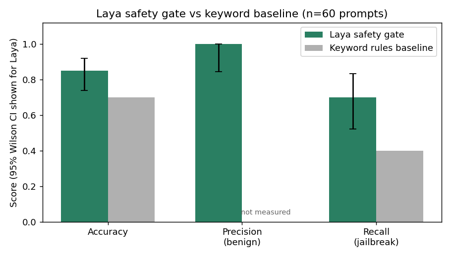
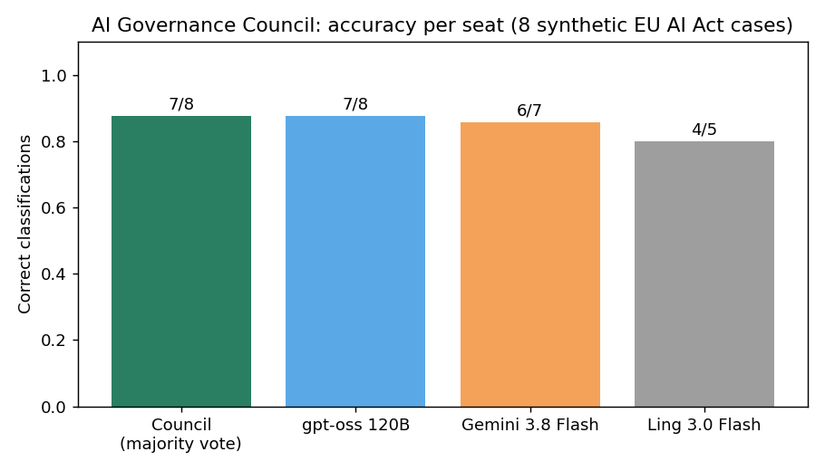
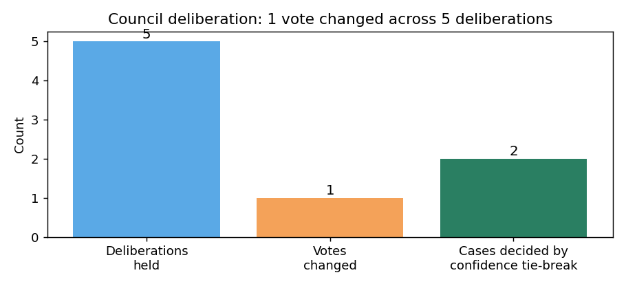

# AI Governance Projects

[](https://github.com/anakha15307/ai-governance-projects/actions)
[](https://www.python.org/downloads/)

I'm Anu, a teacher with seven years in education, training, and assessment.
I started building independent AI governance projects in May 2026, and earned
the IAPP AI Governance Professional (AIGP) certification in 2026. Everything
here is my own learning made public: I design each project, build it with AI
coding assistance, and check the results myself. Nothing here claims to be
professional audit work, legal advice, or production software.

The repo holds **17 projects**: 7 technical builds, 8 analyst/operations
projects, and 2 research experiments, plus **2 companion case studies** that
sit on top of the technical work (the LLM eval case study draws on the
bias-audit and red-team projects).

## Start here

If you are reviewing this repo, follow this order:

1. Skim this README for the map of what's here.
2. Read the three flagship projects below: the Laya experiments, the AI
   Governance Council, and the governance playbook.
3. Walk through [`docs/end-to-end-demo.md`](docs/end-to-end-demo.md) to see
   how the pieces connect across one fictional use case.
4. Run the offline demos (`./run_all_demos.sh`) or the tests (`pytest -q`).
5. Read [`docs/assumptions-and-limitations.md`](docs/assumptions-and-limitations.md)
   before quoting any number: it says exactly what each result can and
   cannot support.

## How to read this repo

**Project types.** Each project is one of:

- **Technical**: working code you can run (a classifier, a harness, a monitor).
- **Analyst**: governance documents and templates (policies, assessments, briefs).
- **Case study**: analysis of real or synthetic cases, no code to run.
- **Research**: a real experiment with methods, results, and stated limits.

**Maturity labels.** No project here is production software. Each one is
labeled honestly:

- **Prototype**: works end to end, but built for demonstration, not deployment.
- **Research**: a real experiment, valid within its stated scope only.
- **Demonstration**: runs and produces real artifacts, on sample or stub data.
- **Template**: a reusable document, meant to be adapted, not used as-is.

## Flagship projects

Three projects carry the most weight. Everything else supports them.

### 16. Laya governance experiments (research)

I tested whether Laya, a 421M-parameter open-source decision model, can serve
as an AI governance layer: a safety gate, a calibrated confidence source, and
a demographically steady judge. On 60 hand-built prompts it reached **85%
accuracy** (100% precision on benign prompts, 70% recall on jailbreaks, with
9 of 30 jailbreaks missed, all through roleplay or hypothetical framing).
Calibration error was 0.125, and a bias probe across six paired scenarios
showed zero decision flips. A 15-keyword rules baseline scored 70% accuracy
and 40% recall on the same prompts. Wilson 95% confidence intervals and a
bootstrap interval for calibration error are in the report, along with the
exact model hash, package versions, and reproduction commands. The report
states plainly that none of this is evidence of production readiness.



Full write-up: [`laya-governance-experiments/report.md`](laya-governance-experiments/report.md),
plus a [model card](laya-governance-experiments/MODEL_CARD.md),
[data card](laya-governance-experiments/DATA_CARD.md),
[threat model](laya-governance-experiments/THREAT_MODEL.md), and
[risk register](laya-governance-experiments/RISK_REGISTER.md).

**What I built.** The experiment design, all 60 hand-written prompts, the
15-keyword rules baseline, the analysis script with the Wilson and bootstrap
intervals, and the report itself. To replay the numbers offline (no installs):
`cd laya-governance-experiments && python3 analyze.py`.

### 17. AI Governance Council (research)

Three LLM seats (Gemini 3.8 Flash, gpt-oss 120B via Groq, Ling 3.0 Flash via
OpenRouter's free tier) independently classified 8 synthetic EU AI Act cases,
deliberated on disagreements, and voted. The council reached **7/8 correct
(87.5%)**, matching the best individual seat. The only miss was legally
debatable under the AI Act's human-review exemption. Two honest findings came
out of it: confidence scores had no signal (0.943 on correct votes vs 0.940 on
wrong ones), and free-tier reliability, not model quality, was the binding
constraint (Ling failed 8 of 16 calls plus all 8 repair attempts).




Full write-up: [`ai-governance-council/FINDINGS.md`](ai-governance-council/FINDINGS.md),
plus a [model card](ai-governance-council/MODEL_CARD.md),
[data card](ai-governance-council/DATA_CARD.md),
[threat model](ai-governance-council/THREAT_MODEL.md), and
[risk register](ai-governance-council/RISK_REGISTER.md).

**What I built.** The 8 synthetic cases, the runner and repair scripts, the
analyzer, and the findings write-up. To replay the numbers offline (no API
keys): `cd ai-governance-council && python3 analyze.py`.

### 15. AI governance playbook (analyst)

An end-to-end operating manual for running an AI governance program at a
mid-size organization: 16 chapters and 11 fillable templates, written in plain
language for the analysts and coordinators who do the work. It ties the rest
of the repo together, cross-referencing the intake, tiering, assessment, and
monitoring tooling in projects 01 through 14.

**What I built.** All 16 chapters and 11 templates, drafted from the
governance questions I wanted a working analyst to be able to answer. There
is no code to run here; the way in is the
[end-to-end demo](docs/end-to-end-demo.md), which walks one fictional use
case through the playbook's intake, tiering, assessment, approval,
monitoring, and incident steps.

## All projects

| # | Project | Type | Maturity | Governance competency |
|---|---------|------|----------|----------------------|
| 01 | [`eu-ai-act-risk-classifier/`](./eu-ai-act-risk-classifier/) | Technical | Demonstration | Risk assessment: classify AI systems under EU AI Act tiers |
| 02 | [`bias-audit-suite/`](./bias-audit-suite/) | Technical | Demonstration | Evaluation: bias probes and fairness report cards (stub models) |
| 03 | [`red-team-harness/`](./red-team-harness/) | Technical | Demonstration | Safety testing: adversarial evals with a before/after scoreboard (stub targets) |
| 04 | [`policy-violation-monitor/`](./policy-violation-monitor/) | Technical | Prototype | Oversight: supervisor monitor with human-in-the-loop escalation |
| 05 | [`model-registry/`](./model-registry/) | Technical | Prototype | Provenance and control: registry with lineage and approval workflow |
| 06 | [`governance-dashboard/`](./governance-dashboard/) | Technical | Demonstration | Reporting: risk register dashboard for stakeholders |
| 07 | [`ai-use-case-intake/`](./ai-use-case-intake/) | Analyst | Prototype | Intake and triage: form, scoring rubric, registry, triage CLI |
| 08 | [`genai-usage-policy/`](./genai-usage-policy/) | Analyst | Template | Policy drafting: GenAI acceptable-use policy and exception template |
| 09 | [`edtech-risk-assessment/`](./edtech-risk-assessment/) | Analyst | Demonstration | Risk assessment: fictional tutoring AI, EU AI Act tiering, NIST AI RMF mapping |
| 10 | [`vendor-ai-assessment/`](./vendor-ai-assessment/) | Analyst | Demonstration | Vendor review: reusable checklist and a completed illustrative assessment |
| 11 | [`regulatory-tracker/`](./regulatory-tracker/) | Analyst | Template | Regulatory tracking: monthly brief template, sample brief, scaffolding script |
| 12 | [`llm-eval-case-study/`](./llm-eval-case-study/) | Case study | Demonstration | Governance case study: turning LLM evaluation evidence into risk decisions |
| 13 | [`khanmigo-risk-assessment/`](./khanmigo-risk-assessment/) | Case study | Demonstration | Third-party risk assessment of Khanmigo from public sources only |
| 14 | [`ai-incident-deconstructions/`](./ai-incident-deconstructions/) | Case study | Demonstration | Incident review: governance deconstructions of 3 real public AI incidents |
| 15 | [`ai-governance-playbook/`](./ai-governance-playbook/) | Analyst | Demonstration | Program operations: 16 chapters, 11 fillable templates |
| 16 | [`laya-governance-experiments/`](./laya-governance-experiments/) | Research | Research | Safety evaluation: safety gate, calibration, and bias probe of a decision model |
| 17 | [`ai-governance-council/`](./ai-governance-council/) | Research | Research | Multi-model oversight: three LLMs classify EU AI Act cases, deliberate, and vote |

## Install and run

Most projects are **standard library only**: Python 3.12, no pip installs,
no API keys, fully offline. Two projects need more, and their READMEs say so
plainly:

- **Project 16 (Laya)** needs the `laya` package and `numpy` (`pip install laya numpy`).
  Everything else in that project (datasets, analysis) is standard library.
- **Project 17 (council)** needs provider API access (Google AI Studio, Groq,
  OpenRouter) to re-run; `analyze.py` replays the committed `results.json`
  offline with the standard library.

| # | Project | Dependencies | Run |
|---|---------|--------------|-----|
| 01 | eu-ai-act-risk-classifier | stdlib only | `python3 classify.py --demo` |
| 02 | bias-audit-suite | stdlib only | `python3 audit.py --demo` |
| 03 | red-team-harness | stdlib only | `python3 run.py --demo` |
| 04 | policy-violation-monitor | stdlib only | `python3 monitor.py --demo` |
| 05 | model-registry | stdlib only | `python3 seed.py --reset` |
| 06 | governance-dashboard | stdlib only | `python3 build.py` |
| 07 | ai-use-case-intake | stdlib only | `python3 triage.py --demo` |
| 08-15 | analyst / case study projects | none (Markdown) | read the docs |
| 16 | laya-governance-experiments | `laya`, `numpy` | see project README |
| 17 | ai-governance-council | provider API keys to re-run; `analyze.py` is stdlib only | see project README |

Run the offline demos in one go:

```bash
./run_all_demos.sh
```

Automated checks live in `tests/` and run on every push via
[GitHub Actions](.github/workflows/ci.yml).

## How these were built

I design each project from a governance question I want to answer, draft the
approach, and build the code and documents with AI coding assistance. The
ideas, the test prompts, the case selections, and the final judgment calls are
mine; I read every result and wrote or rewrote the documentation in my own
words. Where a project leans on AI-generated scaffolding (for example, the
playbook templates), its README says so. I keep it this way because using the
tools is part of what I'm learning to govern.

## Docs

- [`docs/framework-crosswalk.md`](docs/framework-crosswalk.md): how projects map to NIST AI RMF, ISO/IEC 42001, and the EU AI Act, with the exact evidence each project produces.
- [`docs/end-to-end-demo.md`](docs/end-to-end-demo.md): one walkthrough from AI intake through risk assessment, approval, monitoring, and incident response, using this repo's own tooling. The lifecycle diagram is at [`docs/figures/architecture.png`](docs/figures/architecture.png).
- [`docs/monitoring-and-incident-response.md`](docs/monitoring-and-incident-response.md): a proposed monitoring plan and incident reporting, escalation, and rollback procedures.
- [`docs/assumptions-and-limitations.md`](docs/assumptions-and-limitations.md): assumptions, limitations, intended use, and prohibited use, for the repo as a whole.
- [`docs/references.md`](docs/references.md): citations for the legal, regulatory, and technical claims made here.

## Skills coverage

Matrix mapping the analyst skills from a 25-posting sample of junior AI
governance roles (frequency in sample) to the projects demonstrating them.

*Methodology note.* The 25 postings are a convenience sample I gathered
myself from public job boards, and the skill coding is my own. Treat the
percentages as rough ordering of what postings asked for, not as market
statistics.

| Analyst skill (share of postings) | Demonstrated in |
|---|---|
| AI system inventory (40%) | 07 intake registry, 05 model registry, 15 Ch. 2 inventory and intake |
| Use-case intake / triage (36%) | 07 intake form, rubric, triage CLI, 15 Ch. 2 |
| Stakeholder coordination (36%) | 07 intake workflow, 08 policy roles and review path, 10 vendor review, 06 dashboard, 13 stakeholder map and pilot gates, 14 incident findings for leadership, 15 Ch. 1 cadence, Ch. 9 decisions, Ch. 15 board reporting |
| Risk-assessment authoring (36%) | 09 full assessment, 13 third-party assessment (public sources), 01 EU AI Act classifier, 10 vendor findings, 14 incident root-cause analyses, 15 Ch. 3-4 tiering and assessment method |
| Privacy-law adjacency (36%) | 09 data-protection controls, 13 COPPA/FERPA DPA review, 08 data rules, 10 DPA checklist, 15 Ch. 6 data-handling rules, Ch. 12 DPA considerations |
| Regulatory tracking (32%) | 11 monthly briefs, 09 EU AI Act tiering, 15 Ch. 13 crosswalk and change tracking |
| Internal AI policy drafting (24%) | 08 GenAI acceptable-use policy, 15 Ch. 6 policy suite |
| Model safety evaluation (guardrail plus calibration plus bias testing) | 16 Laya experiments, 03 red-team harness, 02 bias-audit suite |

Every project README follows one structure: **problem, users/stakeholders,
methods, results, risks and controls, next steps**, so each reads as a
standalone work sample of how I think and document.

## Why these seventeen

Governance hiring managers look for evidence you can *do* the work: assess
risk, run evaluations, test safety, build oversight, track provenance, and
communicate status. Projects 01-06 show the technical evaluation skills.
Projects 07-11 show the analyst and operations skills junior postings ask for
most: intake, triage, policy drafting, vendor review, and regulatory tracking.
Projects 12-14 show case-study judgment on real and synthetic cases. Project
15 is the operating manual that ties 01-14 together. Project 16 puts a
decision model through the safety, calibration, and bias testing a governance
team would run before piloting it. Project 17 runs a real multi-model AI
governance council on free API tiers and reports honestly on both accuracy and
free-tier reliability. Each project produces an artifact (a report, a
scoreboard, an audit log, a dashboard, a policy, a brief). I add depth and
reproducibility to these rather than adding more projects.

## Limitations of this portfolio

This repo is learning evidence, not independently validated professional
work. I built every project myself (with AI coding assistance, as noted
above), and no employer, auditor, or peer has reviewed the results. Samples
are small (60 prompts, 8 council cases, 68 audit probes), several projects
run on stub or free-tier models, and there are no held-out test sets. The
full list lives in
[`docs/assumptions-and-limitations.md`](docs/assumptions-and-limitations.md).
If you are hiring, treat this as a record of how I think, document, and
test, not as proof that any system here is production-ready.

## Notes

- The EU AI Act classifier is an educational simplification, not legal advice.
- Stub models in the audit and red-team projects are illustrative; each documents how to plug in a real model endpoint.
- See [CHANGELOG.md](CHANGELOG.md) for what changed in each release.
