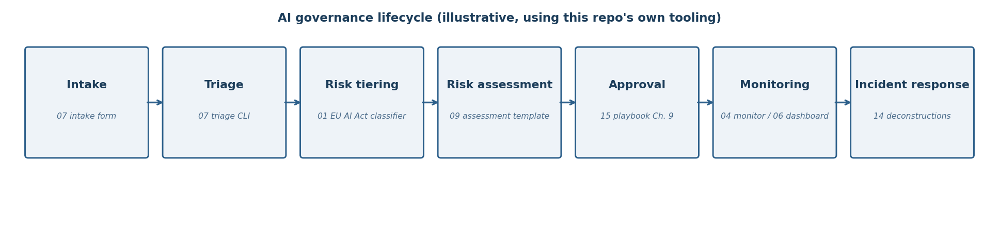

# End-to-end demonstration: from AI intake to incident response

This walkthrough follows one fictional use case through the full governance
lifecycle, using this repo's own tooling at each step. The scenario is
fictional and illustrative. It shows how the pieces connect, not a deployed
system.

**Scenario.** A tutoring company wants to pilot an AI writing coach for
middle-school students. A product manager submits it for governance review.

## 1. Intake

The product manager fills in the standard intake form
([`ai-use-case-intake/intake-form.md`](../ai-use-case-intake/intake-form.md)):
what the tool does, what data it touches (student writing samples, ages
11-14), how it is deployed (vendor-hosted), and the level of human oversight
(teacher reviews flagged essays only).

## 2. Triage

A governance analyst runs the triage CLI
([`ai-use-case-intake/triage.py`](../ai-use-case-intake/triage.py)), which
scores the use case against the rubric
([`triage-rubric.md`](../ai-use-case-intake/triage-rubric.md)). Minor users,
education context, and vendor hosting push it to **Track C**: full risk
assessment required before any pilot. The decision and its reasons are
appended to the registry ([`registry.json`](../ai-use-case-intake/registry.json)).

## 3. Risk tiering

The analyst runs the EU AI Act classifier
([`eu-ai-act-risk-classifier/classify.py`](../eu-ai-act-risk-classifier/classify.py))
on a system card for the writing coach. It returns a tier with matched
categories, rationale, and reviewer flags, plus a tier-appropriate
obligations checklist. The classifier is an educational simplification, so
the analyst treats its output as a starting point, not a legal conclusion.

## 4. Risk assessment

Using the playbook's assessment template
([`ai-governance-playbook/templates/risk-assessment.md`](../ai-governance-playbook/templates/risk-assessment.md)),
the analyst writes a full assessment in the style of project 09: risk
register entries (data minimization, bias in feedback, over-reliance by
teachers), controls with named owners, EU AI Act tiering, NIST AI RMF
mapping, and residual risk. Because students are minors, privacy controls
reference COPPA and FERPA the way project 13 does for Khanmigo.

## 5. Approval

The assessment goes to the governance committee with a deployment decision
record ([`ai-governance-playbook/templates/deployment-decision-record.md`](../ai-governance-playbook/templates/deployment-decision-record.md)).
The committee approves a **limited pilot**: two classrooms, one semester,
teacher review of all AI feedback before students see it, and a go/no-go
review at month three. The model and its datasets are recorded in the model
registry ([`model-registry/`](../model-registry/)) with the approval,
reviewer name, and timestamp.

## 6. Monitoring

During the pilot:

- The policy monitor ([`policy-violation-monitor/`](../policy-violation-monitor/))
  screens AI outputs against the pilot's rules. High-severity violations are
  auto-blocked, medium ones go to a human review queue, and everything lands
  in an append-only audit log.
- The governance dashboard ([`governance-dashboard/`](../governance-dashboard/))
  tracks the pilot's controls and open actions; overdue items surface
  automatically for the monthly committee review.
- The monitoring plan template
  ([`ai-governance-playbook/templates/monitoring-plan.md`](../ai-governance-playbook/templates/monitoring-plan.md))
  defines what gets measured and how often.

## 7. Incident response

In month two, a teacher reports that the coach gave a student sharply
different feedback quality on two similar essays. The analyst follows the
incident runbook
([`ai-governance-playbook/templates/incident-runbook.md`](../ai-governance-playbook/templates/incident-runbook.md)):
contain (pause the pilot in that classroom), log, investigate with the bias
audit suite ([`bias-audit-suite/`](../bias-audit-suite/)) and red-team
harness ([`red-team-harness/`](../red-team-harness/)) to check for systematic
skew, and document the deconstruction the way project 14 does for real
incidents. The committee decides: fix the prompt constraints, re-test, and
only then resume. The full loop is recorded for the next audit.

## What this demonstrates

Each handoff leaves an artifact: a registry entry, a tier assignment, an
assessment, a decision record, an audit log, a dashboard, an incident
report. That chain of artifacts is what "governance" means in practice, and
it is what this repo is built to produce.
